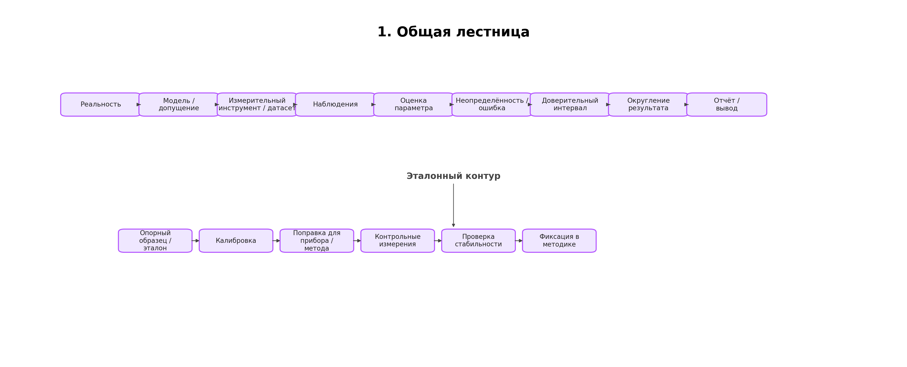
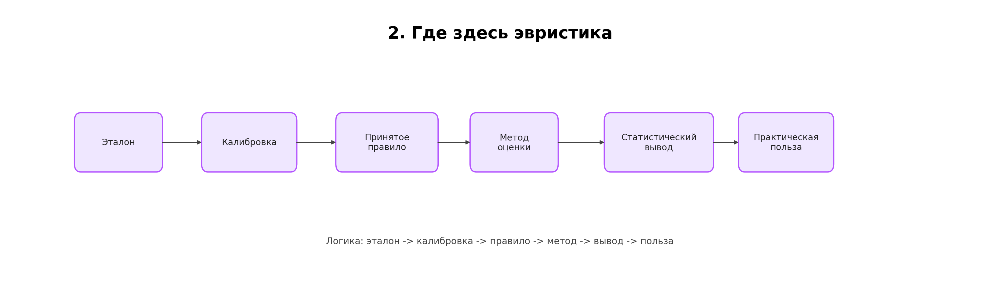
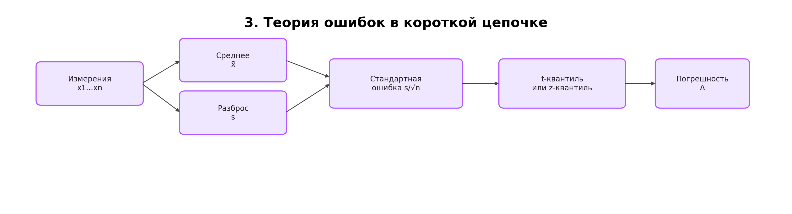
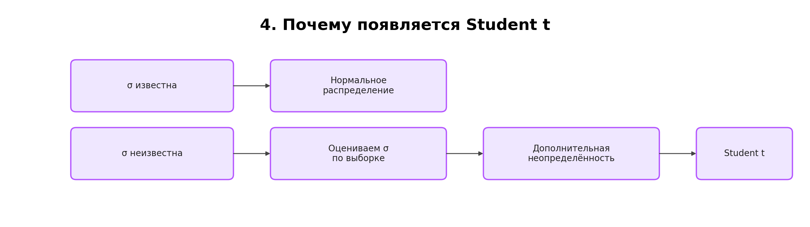
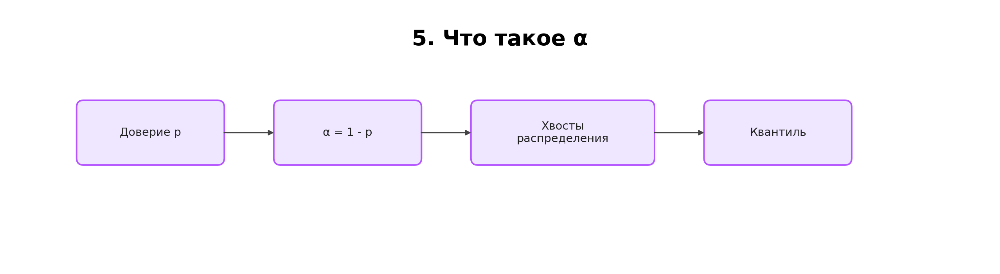
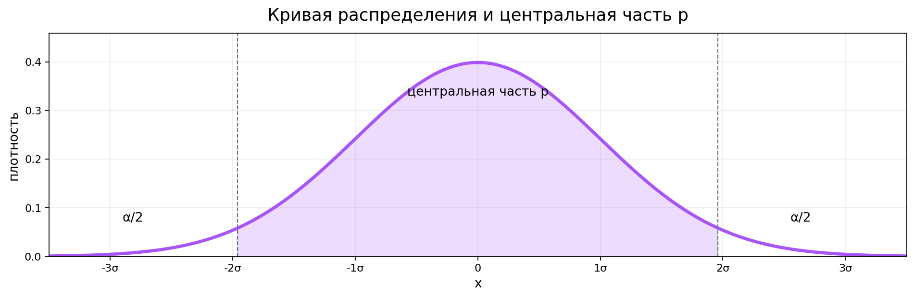
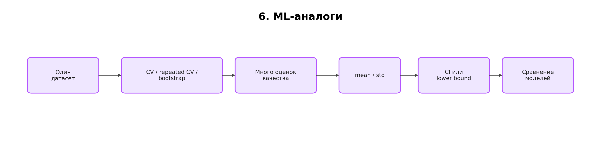
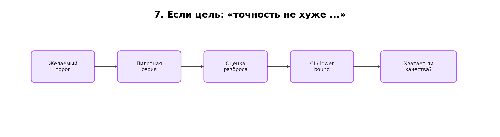
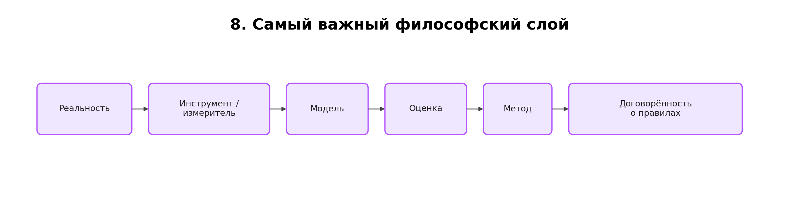
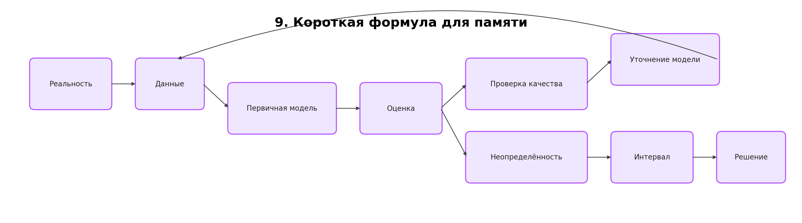

# Теория ошибок и ML: одна общая схема

Короткий вывод: внизу почти всегда лежит не "абсолютное знание", а модель, договорённость и эвристика. Дальше строится инструмент, оценка, интервал и округление.

## 1. Общая лестница

Смысл схемы: мы не получаем истину напрямую, а строим всё более полезные приближения.

## 2. Где здесь эвристика

Эталон тоже не возникает из ничего: его получают через отдельную процедуру.
Калибровка здесь означает сравнение прибора или метода с опорным образцом, чтобы получить поправку или шкалу пересчёта.
"Опорный образец" — это объект или величина, которую в рамках конкретной методики уже заранее закрепили как точку сравнения.
Кто её закрепил? Тот, кто утверждает саму методику: лаборатория, метрологическая служба, производитель прибора, стандарт организации или государственный стандарт.
По какому критерию? По заранее описанной процедуре: либо образец сравнили с более высоким эталоном, либо его стабильность и повторяемость проверили на контрольной серии, либо он задан как норматив внутри утверждённого протокола.
Серия контрольных измерений — это повторные измерения на этом же образце, чтобы проверить, держится ли поправка и не поплыл ли разброс.
После этого эталон используют как точку отсчёта только внутри той процедуры, для которой он был определён.

И здесь важно главное: в конечном итоге эталон, калибровка и контрольные измерения держатся не на каком-то мистическом абсолюте, а на согласованной процедуре, принятом стандарте и проверяемой практике.
То есть фундамент здесь не в "чистом знании мира", а в договорённости о том, как именно сравнивать, как считать и как проверять, что этот способ работает достаточно устойчиво.
Поэтому вся цепочка измерения и оценки — это не доступ к абсолютной истине, а рабочая эвристика, которая подтверждается тем, что она стабильно даёт полезный результат.

Под "полезным результатом" здесь понимается не абстрактная правильность, а то, что метод даёт устойчивый и предсказуемый эффект в своей области: прибор не уходит из допуска, калибровка воспроизводится, самолёт держится в воздухе, а в ML качество модели остаётся выше базового уровня и не разваливается от фолда к фолду.

## 3. Теория ошибок в короткой цепочке

Формально:

$$
\bar x = \frac{1}{n}\sum_{i=1}^n x_i
$$

$$
s = \sqrt{\frac{1}{n-1}\sum_{i=1}^n (x_i-\bar x)^2}
$$

$$
\Delta = t_{1-\alpha/2,\,n-1}\frac{s}{\sqrt n}
$$

Итоговая запись:

$$
\bar x \pm \Delta
$$

## 4. Почему появляется Student t

Если σ неизвестна, мы подставляем её оценку s. Тогда сам знаменатель становится случайным, и нужно учитывать эту дополнительную неопределённость. Поэтому интервал шире, чем при известной σ.

## 5. Что такое α

- $p = 0.95$ означает 95% доверия.
- Тогда $\alpha = 0.05$.
- Для двустороннего интервала по $\alpha/2$ остаётся в каждом хвосте.

**Альфа** — это уровень значимости: доля случаев, когда истинное значение не попадёт в интервал.
Если доверие 95%, то $\alpha = 0.05$, то есть 5% остаются как допустимый риск промаха.
Именно поэтому для двустороннего интервала по 2.5% уходит в каждый хвост распределения.

Квантиль — это граница, которая отделяет центральную часть распределения от хвоста.
Например, $t_{0.975}$ означает точку, левее которой лежит 97.5% массы распределения, а в правом хвосте остаётся 2.5%.
Если говорить совсем грубо, квантиль — это точка отсечения: левее неё лежит заданная доля массы распределения, а правее — оставшийся хвост.

## 6. ML-аналоги

В ML мы обычно не повторяем физический эксперимент, а повторяем оценку модели:

- разные фолды;
- разные seed;
- bootstrap;
- разные подвыборки;
- иногда разные конфигурации препроцессинга.

Это и есть практический аналог "много раз повторить одинаковый эксперимент".

## 7. Что делать, если говорят "хочу точность не хуже ..."

Практический ответ в ML обычно такой:

1. Считаем mean и std по фолдам.
2. Строим доверительный интервал или нижнюю границу.
3. Проверяем, выше ли нижняя граница целевого порога.
4. Если нет, меняем данные, фичи, модель или число наблюдений.

## 8. Самый важный философский слой

На самом фундаменте почти всегда лежит не "чистая истина", а рабочая схема:

- мы выбираем модель;
- калибруем инструмент;
- принимаем соглашения о том, как считать;
- оцениваем неопределённость;
- используем это, потому что система стабильно работает.

Именно поэтому самолёты летают: не потому, что мы всё знаем абсолютно, а потому что цепочка моделей, измерений, допущений и проверок достаточно хороша.
В этом смысле математика и статистика в прикладных задачах не открывают "абсолютную сущность мира", а дают согласованный язык, на котором можно договориться о правилах сравнения и получить устойчиво работающий результат.

## 9. Короткая формула для памяти

Если совсем коротко:

- истина недоступна напрямую;
- доступна только её оценка;
- в ML это не одноразовая стрелка, а цикл: данные -> модель -> оценка -> уточнение -> снова данные;
- качество оценки зависит от модели и инструмента;
- доверительный интервал описывает, насколько этой оценке можно верить;
- округление следует за неопределённостью, а не наоборот.

Важно: схема не про хронологию, а про зависимость шагов друг от друга. Данные нужны для построения модели, а модель нужна для того, чтобы извлечь из данных оценку и проверить, хватает ли этой оценки для решения.
